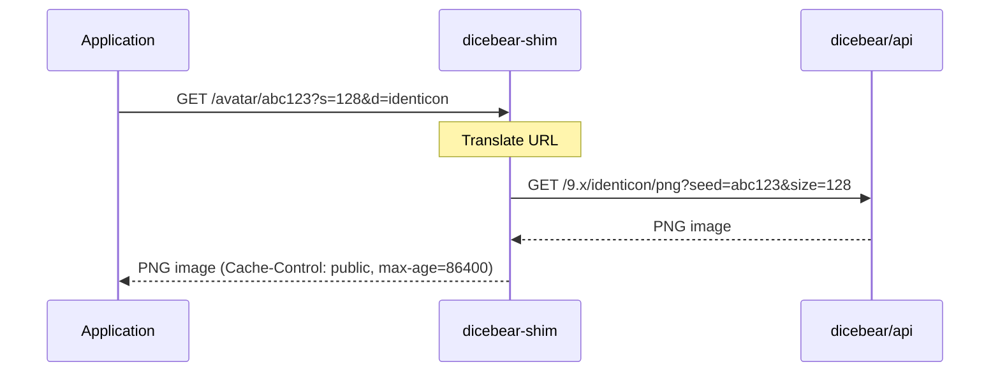

# dicebear-shim

A lightweight Go reverse proxy that translates [Gravatar](https://gravatar.com) avatar URLs into [DICEbear](https://www.dicebear.com) API requests. Deploy alongside a self-hosted `dicebear/api` instance to serve procedurally generated avatars to any application that requests Gravatar URLs -- no internet access required.

## How It Works

```
Client request:
  GET /avatar/abc123?s=128&d=identicon

Shim translates to:
  GET /9.x/identicon/png?seed=abc123&size=128  ->  DICEbear API

Response: deterministic PNG avatar
```



### Style Mapping

The shim maps Gravatar's `d=` (default) parameter to DICEbear styles:

| Gravatar `d=` | DICEbear style |
|----------------|---------------|
| `identicon`    | `identicon`   |
| `retro`        | `pixel-art`   |
| `monsterid`    | `bottts`      |
| `wavatar`      | `adventurer`  |
| `robohash`     | `bottts`      |
| `mp` / default | `shapes`      |


