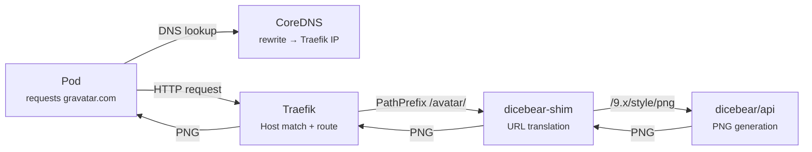

# Kubernetes Deployment

Deploy dicebear-shim on Kubernetes with CoreDNS and Traefik to transparently intercept Gravatar requests from any in-cluster application.

## Architecture



The full request flow:

1. A pod requests `https://www.gravatar.com/avatar/<hash>?s=128&d=identicon`
2. **CoreDNS** rewrites `gravatar.com` DNS to `traefik.traefik.svc.cluster.local` (Traefik's ClusterIP)
3. **Traefik** matches `Host(www.gravatar.com) && PathPrefix(/avatar/)` and routes to `avatars-shim`
4. **dicebear-shim** translates the Gravatar URL to `/9.x/identicon/png?seed=<hash>&size=128`
5. **dicebear/api** generates a deterministic PNG avatar
6. The PNG flows back through the chain to the requesting pod

## Helm Chart

The companion Helm chart lives in the edge builder repo at `services/apps/avatars/`. Install with:

```sh
helm install avatars services/apps/avatars/ -f values.yaml
```

### What Gets Deployed

| Resource | Description |
|----------|-------------|
| `avatars-dicebear` Deployment | Self-hosted DICEbear API (`dicebear/api:3`) |
| `avatars-shim` Deployment | Gravatar URL translator (`ghcr.io/kettleofketchup/dicebear-shim`) |
| `avatars-dicebear` Service | ClusterIP :3000 (internal, shim → dicebear) |
| `avatars-shim` Service | ClusterIP :3001 (exposed to Traefik) |
| `coredns-custom` ConfigMap | DNS rewrite rules for gravatar.com |
| IngressRoute `avatars` | `avatars.<baseDomain>` → shim (direct access) |
| IngressRoute `avatars-gravatar` | `gravatar.com` / `www.gravatar.com` → shim (interception) |
| Certificate (optional) | TLS cert for gravatar.com domains |

### Values

```yaml
# DICEbear backend
dicebear:
  image:
    repository: dicebear/api
    tag: "3"
  env:
    PNG_SIZE_MAX: "512"    # Allow up to 512px PNGs
    WORKERS: "1"

# Gravatar shim
shim:
  image:
    repository: ghcr.io/kettleofketchup/dicebear-shim
    tag: "latest"

# Default avatar style and size
config:
  defaultStyle: identicon
  defaultSize: "80"
  cacheMaxAge: 86400

# CoreDNS rewrite
coredns:
  enabled: true
  traefikService: traefik.traefik.svc.cluster.local
  domains:
    - gravatar.com
    - www.gravatar.com

# Gravatar interception via Traefik
gravatar:
  enabled: true
  hosts:
    - gravatar.com
    - www.gravatar.com
  certificate:
    enabled: false          # Enable for proper TLS
    issuerRef:
      name: root-ca
      kind: ClusterIssuer
```

## CoreDNS Patch

The chart injects rewrite rules into the existing CoreDNS configuration via a `coredns-custom` ConfigMap with an `.override` suffix. This appends rules to the main `.:53` server block without replacing anything.

```
# avatars-gravatar.override (injected into .:53 block)
rewrite name exact gravatar.com traefik.traefik.svc.cluster.local answer auto
rewrite name exact www.gravatar.com traefik.traefik.svc.cluster.local answer auto
```

### How It Works

CoreDNS's `rewrite` plugin with `answer auto`:

1. Intercepts DNS queries for `gravatar.com` / `www.gravatar.com`
2. Rewrites the query to `traefik.traefik.svc.cluster.local`
3. The `kubernetes` plugin resolves this to Traefik's ClusterIP
4. `answer auto` rewrites the response name back to `gravatar.com`

The client sees `gravatar.com → <Traefik ClusterIP>` -- no hardcoded IPs, no separate DNS server.

!!! note "Plugin execution order"
    CoreDNS plugin order is determined at compile time, not by Corefile order. The `rewrite` plugin always runs before `kubernetes`, so `.override` injection works regardless of where the `import` directive appears.

### Verify DNS Rewrite

After deploying, verify from any pod:

```sh
# Should return Traefik's ClusterIP, not an external IP
nslookup www.gravatar.com
dig www.gravatar.com +short
```

## TLS Considerations

When CoreDNS rewrites `gravatar.com` to Traefik, HTTPS clients will expect a valid TLS certificate for `gravatar.com`. By default, Traefik serves its default certificate which won't match.

### Option 1: Internal CA Certificate (recommended)

Enable the cert-manager Certificate resource:

```yaml
gravatar:
  certificate:
    enabled: true
    issuerRef:
      name: root-ca
      kind: ClusterIssuer
```

This issues a cert for `gravatar.com` and `www.gravatar.com` using your internal CA. Pods that trust the internal CA will accept the connection.

### Option 2: HTTP Only

If applications make HTTP (not HTTPS) requests to Gravatar, no TLS configuration is needed. The chart includes both `web` and `websecure` entrypoints on the gravatar IngressRoute.

### Option 3: Skip TLS Verification

Some applications allow disabling TLS verification for avatar URLs. This is environment-specific and not recommended for production.
